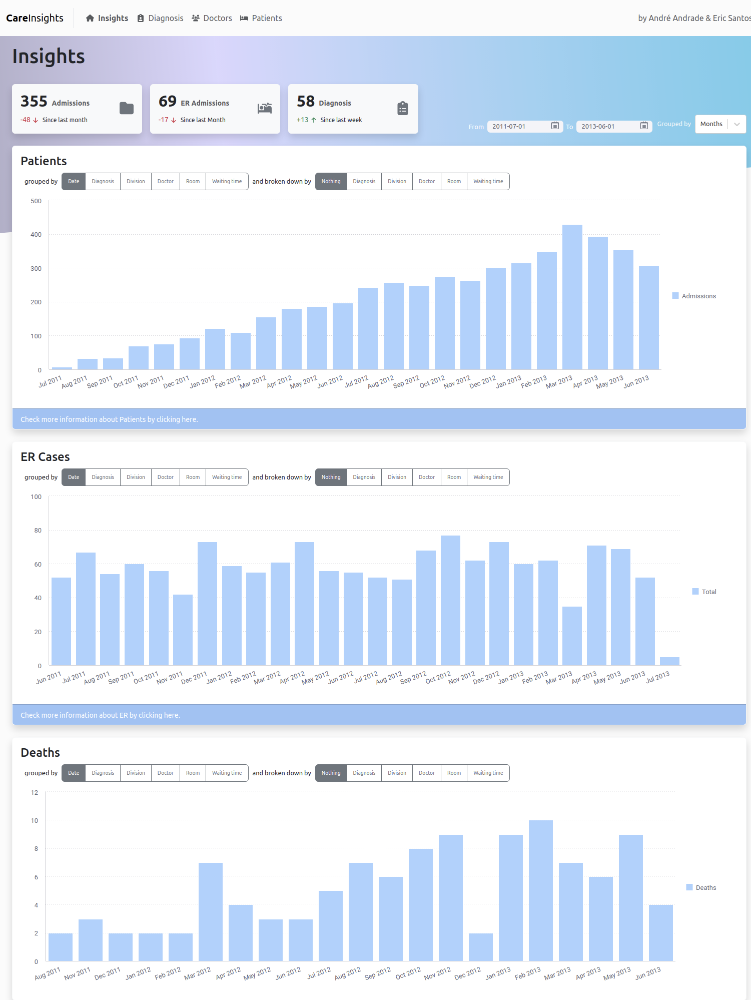
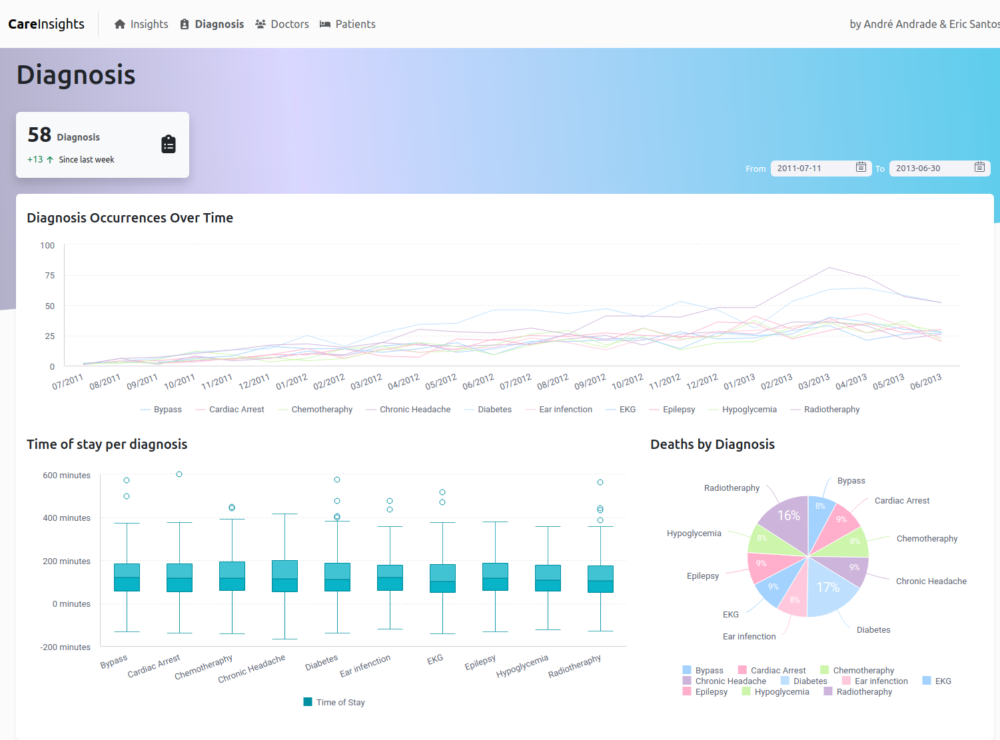
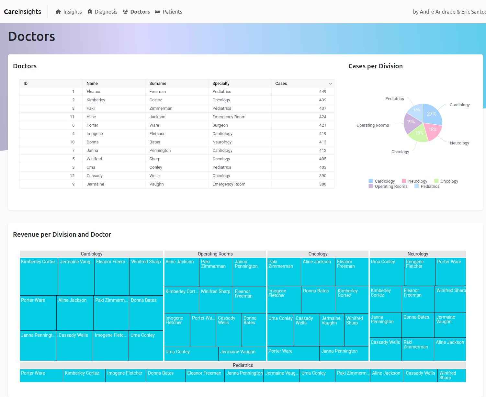
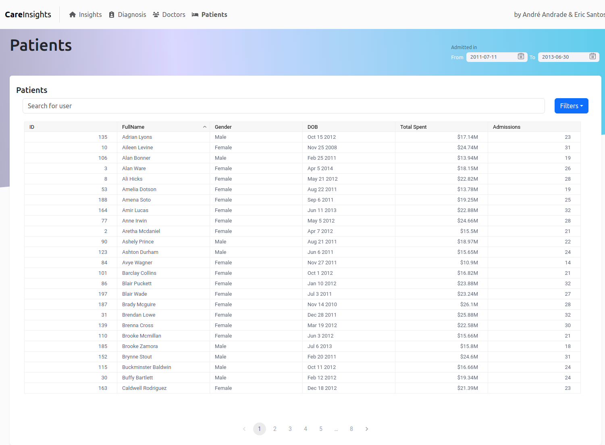

### Sisense Hackaton Project
Project developed for Sisense [Analytics in Action: A compose SDK hackaton](https://www.sisense.com/platform/compose-sdk/hackathon/)

Using [Sisense SDK](https://sisense.dev/guides/sdk/getting-started/) and [Vite](https://vitejs.dev/)

Developed by:
- [André Andrade](https://github.com/oandrevictor)
- [Eric Santos](https://github.com/ericbreno)

### How to run

#### Prerequisites
- Node v19.7.0 or greater
- npm v9.5.0 or greater
- Have a Compose SDK token ([get a 30-day free trial here](https://www.sisense.com/platform/compose-sdk-free-trial/))

1. Run `$ npm install`
2. Add your Compose SDK token in `/src/index.tsx` `token` parameter:
```tsx
<SisenseContextProvider
  url="https://trial-bi-prod.sisense.com/"
  token="<token here">
```
3. Run `$ npm run dev`
4. Access the page locally at `http://localhost:5173/#`

### Folder structure

All code is under the `/src` folder:

- `/src/index.tsx` app entrypoint, where Sisense context is bootstraped 
- `/src/App.tsx` app base page, holding shared layout elements (like the sidebar)
- `/src/pages` each application page will be a component in this folder
- `/src/components` components used by the pages
- `/src/utils` shared functions and variables used across the project
- `/src/app.css` styles for the project

### Application
**Home Page**  
Here you have some quick insights about how your hospital is performing and more important metrics. Filter data by a date range, change aggregation granularity and break charts down to get more insights.


**Diagnosis insights**  
Dive into the diagnosis evolutions, how long are the stays, you can click on a diagnosis to explore it's data or filter by date range.


**Doctors insights**  
Data about how doctors are performing, cases they have been working and divisions where the hospital's revenue is coming from


**Patients insights**  
List of patients where you can check some quick info on them and filter by name or gender
